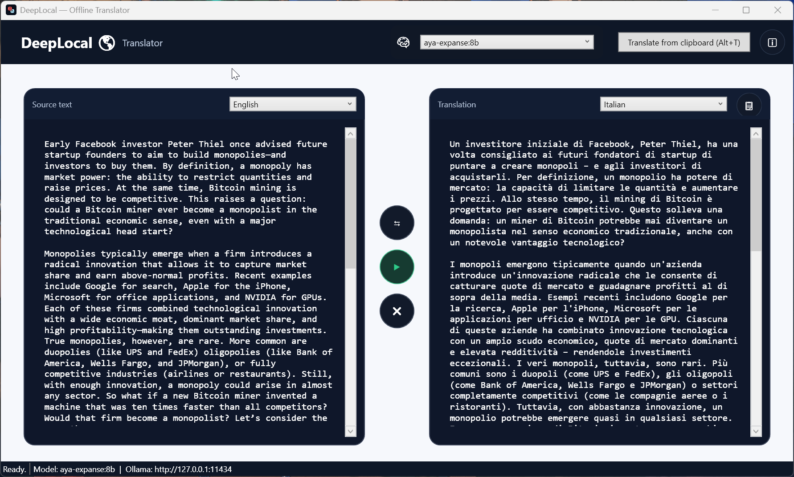

# DeepLocal, Offline Translator (WPF + Ollama)

### DeepLocal is a clean WPF desktop app that brings DeepL-style translation fully offline via Ollama. Two-pane UI, auto-detect, swap, and model picker (default: gemma3:12b). Built with .NET 8.

# ✨ Features

Interface inspired by DeepL: two panels (source → translation)

Auto-detect of the source language (the selector automatically switches to the recognized language)

Coherent swap (swaps texts and languages without forcing English)

Ollama model selector (default gemma3:12b; mistral:latest, aya-expanse:8b, gpt-oss:20b, gpt-oss:120b-cloud)

Quick actions: Paste, Copy, Translate ▶️

Tray app: starts minimized, double-click to show/hide, right-click menu

Window position anchored to the bottom-right when it reappears from the tray

Main supported languages (IT, EN, ES, FR, DE, PT, RU, HE, JA, ZH). For unsupported languages: “language not supported”

# 📦 Requirements

Windows 10/11

Ollama running at http://127.0.0.1:11434

.NET 8 SDK (only if you want to build from source)

# ✅ Compatible models (tested)

- gemma3:12b (Default)

- mistral:latest

- aya-expanse:8b

- gpt-oss:20b

- gpt-oss:120b-cloud

Quick model installation (Ollama):
```bash
ollama pull gemma3:12b
ollama pull mistral:latest
ollama pull aya-expanse:8b
ollama pull gpt-oss:20b
# If available in your instance:
ollama pull gpt-oss:120b-cloud
```

DeepLocal selects gemma3:12b by default. You can change the model from the menu at the top right.
Note: gpt-oss:120b-cloud may not be available on all local installations; in that case use gemma3:12b or one of the other listed models.

# 🧑‍💻 Build from source
```bash
git clone https://github.com/<your-user>/DeepLocal.git
cd DeepLocal
dotnet build
dotnet run
```

Main structure:
```bash
DeepLocal.csproj
App.xaml / App.xaml.cs
MainWindow.xaml / MainWindow.xaml.cs
Assets/ (icons and images)
```
# ⬇️ Download Windows EXE

### "DeepLocal – First Official Release (Stable)"

Get the DeepLocal Windows installer (ITA/ENG) from release v1.0.0:
https://github.com/ShinRalexis/DeepLocal/releases/tag/v1.0.0

Works on Windows 10/11. Requires Ollama running at http://127.0.0.1:11434.
The installer sets up Start menu shortcuts, tray icon, and optional Start with Windows.

# ⌨️ Shortcuts

Ctrl+V paste into source

Ctrl+C copy the translation

Enter start translation

Double-click the tray icon show/hide

Right-click the tray icon: Open / Exit

# 🐞 Troubleshooting

“END” at the end: removed in recent versions; update if you still see it.

Window doesn’t reappear: check the tray icon and double-click it.

Model not found: run ollama pull <model> and make sure Ollama is running.

# 🤝 Contributing

Fork → branch feat/feature-name

Keep XAML/Assets style consistent

Submit a PR with description and screenshots

# 📣 Support & Donations

If DeepLocal helps you, even $1 is a “hey friend, thanks!” ❤️

Liberapay: https://liberapay.com/MetaDarko/donate

Bitcoin: [1NjV2CfyLw42Ej9UmZEcroyqnmmKMJNCUx](https://www.blockchain.com/explorer/addresses/btc/1NjV2CfyLw42Ej9UmZEcroyqnmmKMJNCUx)

@MetaDarko: https://github.com/ShinRalexis

For bugs/ideas open an Issue including app version, Windows version, steps, and screenshots.

# 📝 Licenses

Code (MIT)
Copyright © 2025 MetaDarko.
Permission is hereby granted, free of charge, to any person obtaining a copy of this software and associated documentation files (the “Software”), to deal in the Software without restriction, including without limitation the rights to use, copy, modify, merge, publish, distribute, sublicense, and/or sell copies of the Software, and to permit persons to whom the Software is furnished to do so, subject to the following conditions: the above copyright notice and this permission notice shall be included in all copies or substantial portions of the Software.
THE SOFTWARE IS PROVIDED “AS IS”, WITHOUT WARRANTY OF ANY KIND, EXPRESS OR IMPLIED.

Images/Assets (CC BY 4.0)
/Sample_1.png and other graphic assets are © 2025 MetaDarko and distributed under Creative Commons Attribution 4.0 International: you may use them freely, including commercially, provided that you attribute “MetaDarko DeepLocal” and indicate any changes.
Full text: https://creativecommons.org/licenses/by/4.0/

In short: the rights remain yours, but anyone can freely use the code and images (with attribution for assets).
